# GetOrganelle Mitochondrial Genome Assembly

This project demonstrates how to assemble organelle genomes — specifically mitochondrial DNA — using **GetOrganelle**, a powerful tool for extracting organelle sequences from whole-genome shotgun data.

We use data from the **Mitofish** database and walk through the steps of environment setup, database configuration, genome assembly, and annotation.

## Table of Contents
- [Overview](#overview)
- [Prerequisites](#prerequisites)
- [Installation](#installation)
- [Database Setup](#database-setup)
- [Genome Assembly](#genome-assembly)
- [Annotation](#annotation)
- [Example Workflow](#example-workflow)
- [Troubleshooting](#troubleshooting)
- [References](#references)

## Overview

GetOrganelle is a toolkit designed to assemble organellar genomes from genomic skimming data. It's particularly effective for:
- Mitochondrial genomes
- Plastid/chloroplast genomes
- Nuclear ribosomal DNA

This tutorial focuses on **mitochondrial DNA assembly** using fish genomic data from Mitofish.

## Prerequisites

If you are running in a remote server, please make sure that you have at least the
following facilities.

- Python 3.7 or higher
- At least 8GB RAM (16GB recommended)
- 20GB free disk space
- Basic command-line knowledge
- UNIX/Linux or macOS environment (Windows users can use WSL)

## Installation

### Option 1: Using the conda environment without any .Yml file.

``` bash
# Create a new Organelle with a specific python. env
conda create -y -n organelles_1 python=3.9

# Activate the environment.
conda activate organelles_1

# Install GetOrganelle
conda install -c bioconda getorganelle

# Download seed and label databases
get_organelle_config.py --add embplant_pt,embplant_mt,animal_mt
```

### Option 2: Using Conda (Recommended) - Using the .yml file.

```bash
# Create a new conda environment
conda env create -f environment.yml
conda activate getorganelle

# Install GetOrganelle
conda install -c bioconda getorganelle

# Download seed and label databases
get_organelle_config.py --add embplant_pt,embplant_mt,animal_mt
```

### Verify Installation

```bash
get_organelle_from_reads.py --version
```

## Database Setup

### Mitofish Database (UP COMMING ...)

Mitofish is a comprehensive database of fish mitochondrial genomes. To use it with GetOrganelle:

1. **Download reference genomes from Mitofish:**
2. **Prepare custom seed database (optional):**
### Configure GetOrganelle for Animal Mitochondria

## Genome Assembly

### Input Data Preparation

GetOrganelle works with paired-end Illumina reads. Organize your data:

```bash
mkdir -p data/raw_reads
# Place your FASTQ files here:
# - sample_R1.fastq.gz (forward reads)
# - sample_R2.fastq.gz (reverse reads)
```

### Basic Assembly Command

```bash

#create an output folder.

mkdir output

# Run GetOrganelle for mitochondrial genome assembly
get_organelle_from_reads.py \
  -1 data/raw_reads1/FRa3_R1.trimmed.fastq.gz \
  -2 data/raw_reads1/FRa3_R2.trimmed.fastq.gz \
  -R 10 \
  -k 21,45,65,85,105 \
  -F animal_mt \
  -t 8 \
  -s ~/.GetOrganelle/SeedDatabase/SardinaMH329246.fasta \
  -o "./output/mtDNA_sample_R"

# Parameters:
# -1, -2: Input paired-end reads
# -o: Output directory
# -R: Rounds of extension
# -k: K-mer values for assembly
# -F: Organelle type (animal_mt for animal mitochondria)
# -t: Number of threads
```

### Output Files

After assembly, check the output directory:

```bash
mtDNA_sample
├── animal_mt.K*.assembly_graph.fastg    # Assembly graph
├── animal_mt.K*.assembly_graph.fastg.extend_animal_mt-GenomeType_*.fasta  # Extended contigs
├── animal_mt.K*.path_sequence.fasta     # Final assembled sequence(s)
├── get_org.log.txt                       # Log file
└── filtered_spades/                      # SPAdes assembly intermediate files
```

## Annotation

### Using MitoZ for Annotation


### Using MITOS

### Visualization

## Example Workflow (Up Comming)

Complete workflow script (`scripts/assemble_mitochondria.sh`):

## Troubleshooting

## 🐛 Troubleshooting Decision Tree

## 🐛 Troubleshooting Decision Tree


```mermaid
flowchart TD
    A[Run SPAdes Assembly] --> B{Did it finish successfully?}

    B -- Yes --> C[✅ Done! Proceed to annotation]

    B -- No --> D{Error code -4?}

    D -- Yes --> E[Check available RAM with free -h or htop]
    E --> F{Enough memory?}

    F -- No --> G[Request more memory / reduce k-mers]
    G --> A

    F -- Yes --> H[Check FASTQ integrity with FastQC / zcat]
    H --> I{Files OK?}

    I -- No --> J[Re-download or fix input files]
    J --> A

    I -- Yes --> K[Recreate Conda environment]
    K --> L[Remove old env and recreate with Python 3.9 + GetOrganelle]
    L --> A

    D -- No --> O[Check logs for other errors and adjust parameters]
```

### Common Issues

**1. Assembly produces multiple contigs**
- Increase `-R` (rounds of extension)
- Try different k-mer values
- Check if coverage is sufficient (>30x recommended)

**2. Low coverage warnings**
```bash
# Reduce --max-reads or increase input data
get_organelle_from_reads.py ... --max-reads 5E6
```

**3. No organelle genome found**
- Verify input data quality
- Check that reads contain mitochondrial sequences
- Try using a custom seed database from a closely related species

**4. Memory errors**
- Reduce number of threads (`-t`)
- Reduce `--max-reads` parameter
- Use a machine with more RAM

### Quality Assessment

```bash
# Check assembly completeness
grep ">" output/sample_mt/*.path_sequence.fasta

# Verify typical mitochondrial genome size (fish: 15-18 kb)
seqkit stats output/sample_mt/*.path_sequence.fasta

# Check for circular assembly
grep "circular" output/sample_mt/get_org.log.txt
```

## Best Practices

1. **Pre-process reads**: Trim adapters and low-quality bases before assembly
2. **Coverage**: Aim for at least 30x mitochondrial coverage (100x+ is better)
3. **Multiple k-mers**: Use multiple k-mer values for robust assembly
4. **Reference selection**: Use closely related species references when available
5. **Validation**: Compare assembled genome with known references
6. **Circularity**: Verify that the mitochondrial genome is circular

## Data Structure

Recommended project organization:

```
GetOrganelle/
├── data/
│   ├── raw_reads/           # Input FASTQ files
│   ├── references/          # Reference genomes from Mitofish
│   └── custom_database/     # Custom seed databases
├── output/                  # Assembly outputs
├── annotations/             # Annotation results
├── scripts/                 # Workflow scripts
├── qc_reports/             # Quality control reports
├── environment.yml         # Conda environment
└── requirements.txt        # Python dependencies
```

## References

1. **GetOrganelle**: Jin et al. (2020) Genome Biology [https://github.com/Kinggerm/GetOrganelle](https://github.com/Kinggerm/GetOrganelle)
2. **Mitofish**: Sato et al. (2018) Molecular Biology and Evolution [http://mitofish.aori.u-tokyo.ac.jp/](http://mitofish.aori.u-tokyo.ac.jp/)
3. **MitoZ**: Meng et al. (2019) Nucleic Acids Research [https://github.com/linzhi2013/MitoZ](https://github.com/linzhi2013/MitoZ)
4. **MITOS**: Bernt et al. (2013) Nucleic Acids Research [https://mitos2.bioinf.uni-leipzig.de/](https://mitos2.bioinf.uni-leipzig.de/)

## Citation

If you use this workflow, please cite:

```
Jin, J.J., Yu, W.B., Yang, J.B., Song, Y., dePamphilis, C.W., Yi, T.S., & Li, D.Z. (2020).
GetOrganelle: a fast and versatile toolkit for accurate de novo assembly of organelle genomes.
Genome Biology, 21(1), 241.
```

## License

This project is licensed under the MIT License - see the [LICENSE](LICENSE) file for details.
